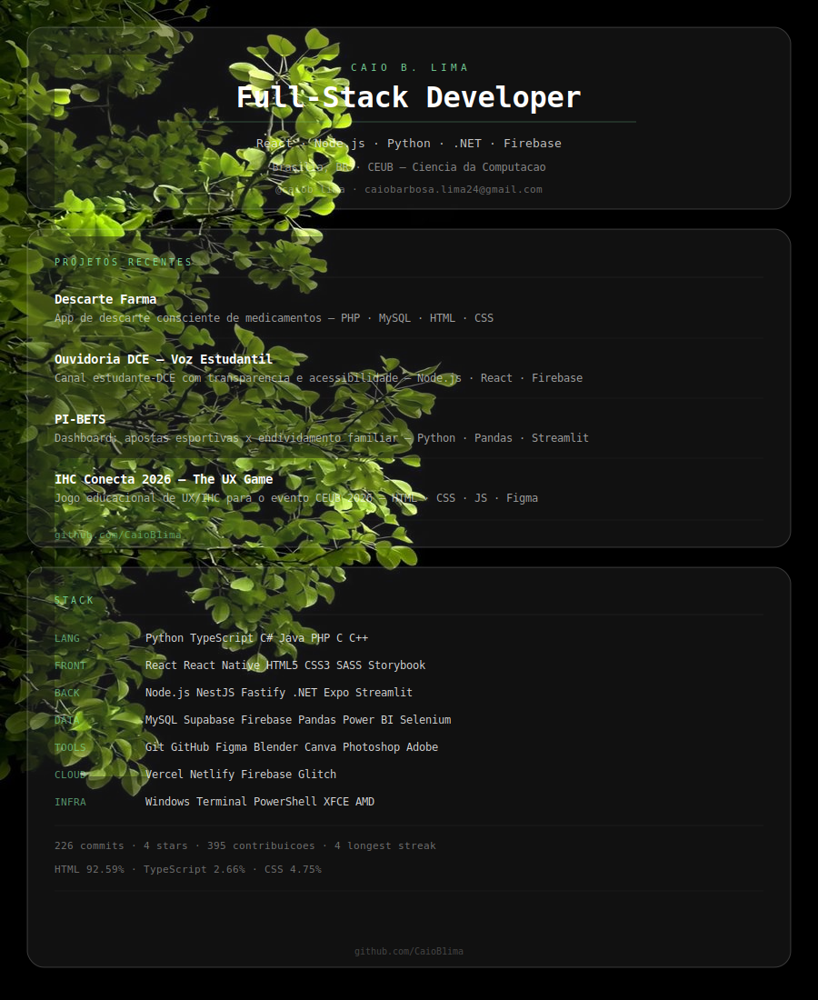

  

---

  
  

<picture>
  <source media="(prefers-color-scheme: dark)" srcset="https://raw.githubusercontent.com/CaioB1ima/CaioB1ima/pacman-output/pacman-contribution-graph-dark.svg">
  <source media="(prefers-color-scheme: light)" srcset="https://raw.githubusercontent.com/CaioB1ima/CaioB1ima/pacman-output/pacman-contribution-graph.svg">
  
</picture>

###
